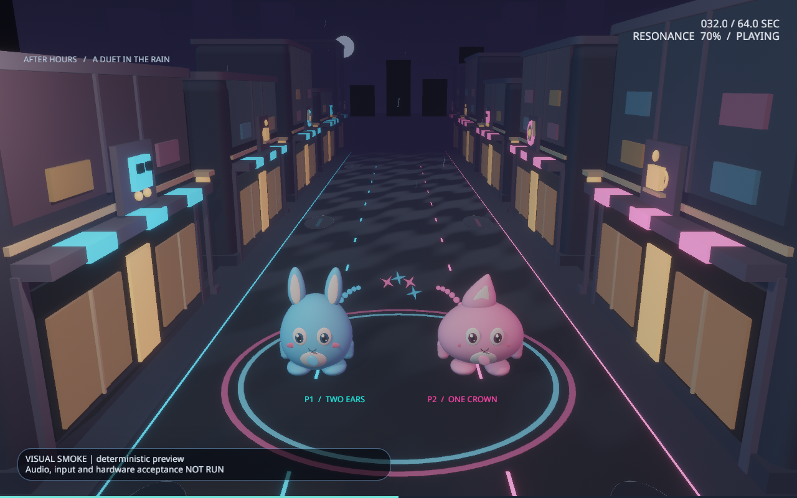

# 雨夜表现打磨

2026-10-09 本轮把角色曲面、街区细节、光影和确认落点反馈接入正式游戏，继续采用原创蓝粉玩具与雨夜方向；《喵斯快跑》作为完成度参考，本轮软件检查和画面目检不代表已经达到相同商业质量等级

## 画面变化

| 部分 | 当前实现 |
|---|---|
| 角色 | 连续柔软曲面、分层眼睛与高光、胸前标记、曲面鞋、表情和关节；双耳与单冠提供颜色之外的玩家身份 |
| 地图 | 两侧各六栋完整店面循环，咖啡、唱片、交通图标与暖窗、圆角屋檐、路灯、远景城市和渐变夜空；建筑所有零件共享移动基点，完全经过相机后整体循环 |
| 光影 | 原生 PBR 环境光、粗糙度贴图与清漆湿路材质、暖主光和蓝粉辅光、克制雾与天空纵深；环境贴图是原创解析光斑，不是实时街道镜面反射或外部 HDR |
| 特效 | 固定池的水滴、音符、汇聚弧线、星芒和轻量 Miss 断环；共同单环与双环仍只表现 core 已确认事实，Good 维持原 0.68 倍强度和相同运动时长 |

[改动前](images/visual-polish-before.png) · [改动后](images/visual-polish-after.png)

两张对照均使用 `--feedback-smoke anchor` 与 1280×800 完整 3D 输出；新版 smoke 使用 Running 展示实际关节动作，旧版 smoke 使用 Resting，对照用于检查画面变化

## 时间与资源约束

街区、跑动和规则反馈使用现有 SongTime 与展示状态，暂停保持原歌曲游标；Ready 独立待机，暂停 / 转场冻结关节，终局恢复静态表情，歌曲游标的明确重定位重建对应装饰状态

Stage 轨道、曲道、桥段、Anchor、根轨迹与判定历史保持原事实；湿路 UV 直接更新已有缓冲区，城市场景属于装饰父实体，世界底面位于正式 Stage 之下

装饰池固定 162 个实体，效果资产和三个光照贴图跨场景刷新复用，每帧不创建 mesh、material 或 texture；当前 CPU 检查要求全场景网格实体不超过 900，mesh / material 资产分别不超过 40 / 64，该上限用于资源回归，不是 GPU 性能预算

关闭装饰与低画质保留角色身份、本地半涟漪、共同单环 / 双环及预告；逻辑宽度低于 600 时玩家标记使用 P1/P2，大窗口恢复当前语言的完整角色名

全部模型、图标、天空、材质贴图和装饰网格由仓库源码生成，来源与哈希见 [资源台账](../licenses/ASSET_PROVENANCE.csv)，本轮不新增运行依赖

## 验证

运行时 196 项测试、Clippy、格式、workspace 边界、Game debug 与优化构建通过；测试包含曲面边界与法线、街区接缝的整组偏移、暂停游标、必要反馈与关闭装饰、缓存复用及 400×300 文本布局

13 张最终 GPU 截图逐张目检，覆盖 Local / Free / Anchor / Good / Miss / Approach、四档画质、400×300、Stage 3 曲道与桥段及 Ready；显式预设 smoke 使用既有缩小 3D 输出，实际分辨率分别保留在观察记录中

240 帧实际 core 驱动 GPU 动效已经捕获，19 个关键帧目检覆盖局部输入、Free、Good、Precise、Miss、两处循环接缝和尾部清空；30 Hz、8 秒 [本机录像](../target/visual-polish-20261009/cocobeat-visual-polish.mp4)由这些顺序帧编码，输入是软件生成，录像不证明物理输入、音频听感或显示器 FPS

本机 AMD Radeon RX 6650 XT / Vulkan 的冻结优化版本完成 1920×1080、High、limited60 独占原生窗口与实际 Kira 播放，13/13 软件输入、5 次 Anchor Sync 和 1 次 Free Sync 后自然 EOF；Running 主更新间隔 p95 / p99 为 16.732706 / 16.736692 ms，峰值 RSS 534268 KiB，主不透明 GPU pass 全观察 p95 为 6.2552 ms，异步 GPU 分项不相加或绑定具体显示帧，该单样本不代替显示器 FPS、VRAM 和其他设备预算

原始截图、源码 / 二进制冻结、命令与哈希见[本轮观察](../testdata/synthetic/visual-polish-observations-20261009.json)，首轮空白前景店面、小窗口标签与测试精度问题及修正记录保留在本机 `target/visual-polish-20261009/`

## 后续打磨

后续增加独立段落布景与转场、减少长曲视觉重复，并通过真实显示器与双人试玩调整共同反馈的读图速度、情绪和高潮层次；四目标性能预算、VRAM、物理手柄 / 混合输入、音乐听感与商业完成度仍需分别验收
